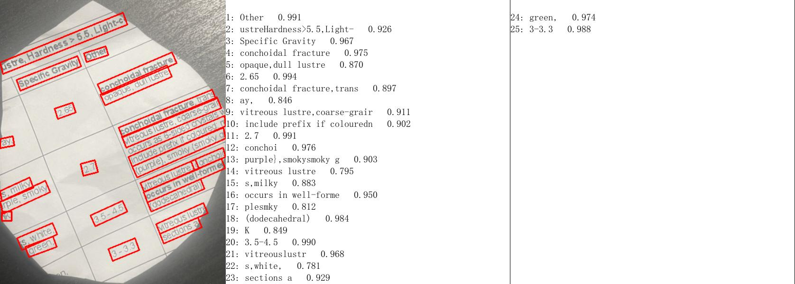

# OCR Text Detection

This project is an Optical Character Recognition (OCR) system that uses image processing techniques and PaddleOCR to detect and extract text from images.

## Features

- **Image Preprocessing**: Converts images to grayscale and applies thresholding to prepare them for text detection.
- **Text Detection**: Utilizes PaddleOCR to detect and extract text from images.
- **Contour Detection**: Identifies the boundaries of text areas using edge detection and contour analysis.
- **Image Resizing**: Includes functionality to resize images based on specified width or height while maintaining aspect ratio.
- **Text Display**: Displays the detected text on the image with bounding boxes around the detected text regions.

## Technologies Used

- **OpenCV**: For image processing tasks such as grayscale conversion, thresholding, and contour detection.
- **PaddleOCR**: A deep learning-based OCR tool used to recognize and extract text from images.
- **NumPy**: For handling arrays and image data.
- **Pillow**: For image manipulation and visualization.

## Installation

1. **Install Python and Dependencies**:
   Ensure Python 3.x is installed on your machine. Install the required dependencies using pip:
   ```bash
   pip install opencv-python-headless numpy paddlepaddle paddleocr pillow
   ```

2. **Clone the Repository**:
   ```bash
   git clone https://github.com/your-repo/OCR-Text-detection.git
   cd OCR-Text-detection
   ```

3. **Run the Project**:
   Run the main script to detect text in an image:
   ```bash
   python main.py
   ```

## Usage

- Place your image file in the project directory or in the `testImg` folder.
- The script processes the image, detects text, and displays the image with bounding boxes around the detected text regions.

## Functions

- `imageProcessed(image)`: Converts the input image to grayscale and applies thresholding.
- `resize(img, width=None, height=None)`: Resizes the image to the specified width or height while maintaining aspect ratio.
- `findContours(img)`: Detects contours of text regions in the preprocessed image.
- `showImage(img)`: Displays the processed image using OpenCV's `imshow` function.

## Example

1. **Original Image**:
   

2. **Detected Text**:
   
